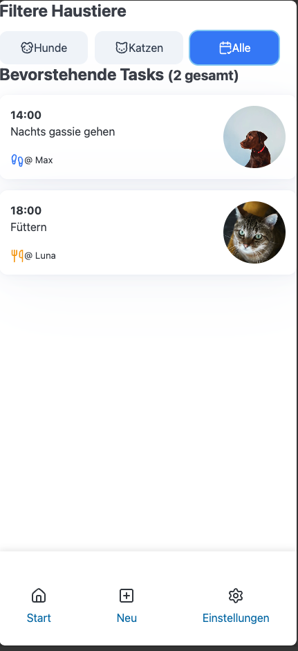

# 🐶 Pet Care Tracker

Eine mobile Progressive Web App (PWA), die Haustierbesitzer:innen dabei unterstützt, die Pflege ihrer Tiere zu organisieren.

# Das folgende Projekt befindet sich in der Bearbeitung !

  
---

## 📌 Überblick

Pet Care Tracker ist eine Webanwendung, die Nutzer:innen bei der Organisation von täglichen und langfristigen Aufgaben rund um ihre Haustiere unterstützt. Es können Haustiere angelegt sowie Fütterungszeiten, Tierarzttermine und Impfungen geplant werden.

Die Anwendung erinnert über Benachrichtigungen an anstehende Aufgaben und ist so konzipiert, dass sie auch offline funktioniert. Daten werden lokal gespeichert und bei bestehender Internetverbindung mit einer Datenbank synchronisiert.

---



## ✨ Funktionen

- 🐾 Haustiere anlegen und verwalten  
- ⏰ Fütterungszeiten planen  
- 💉 Impfungen und Tierarzttermine verwalten  
- 🔔 Erinnerungen für anstehende Aufgaben erhalten  
- 📶 Offline-Funktionalität mit lokaler Datenspeicherung  
- ☁️ Synchronisation mit einer Datenbank  
- 📱 Installierbar als mobile App (PWA)  

---

## 🎯 Ziel des Projekts

Ziel des Projekts ist die Entwicklung einer mobilfreundlichen Webanwendung, die zentrale Konzepte von Progressive Web Apps demonstriert, darunter:

- Offline-Fähigkeit  
- Push-Benachrichtigungen  
- Responsives Design  
- Integration mobiler Gerätefunktionen  

---

## 🧩 Kernfunktionalität

Nutzer:innen können:
- mehrere Haustiere anlegen und verwalten  
- Erinnerungen für verschiedene Aufgaben erstellen  
- anstehende Termine und Aufgaben einsehen  
- Benachrichtigungen für wichtige Aktivitäten erhalten  

---

## 📍 Optionale Funktionen

- 🗺️ Anzeige von Tierarztpraxen in der Nähe (Standortbasiert)  
- 🐕 Tracking von Spaziergängen mittels Geolocation  
- 📊 Erweiterung um einfaches Health-Tracking  

---

## 🛠️ Technologie-Stack

- Frontend: React  
- Backend: Node.js mit Express  
- Datenbank: MongoDB  

---
## 🚀 Installation

```bash
# Clone Repository
git clone https://github.com/Dave200s1/PetCare-Tracker-.git

# Navigiere in den Projektordner
cd pet-care-reminder

# Dependencies installieren
npm install

# Development server starten
npm run dev
