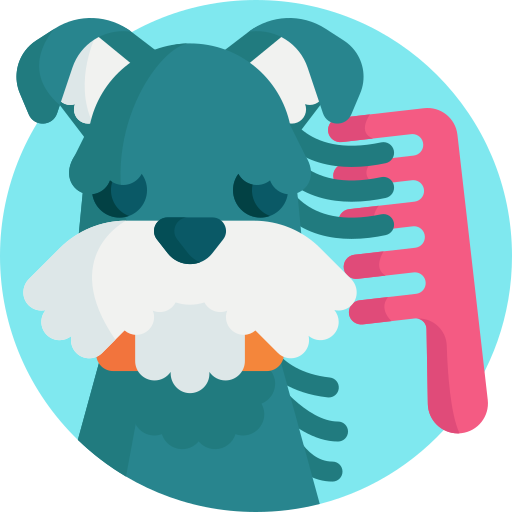
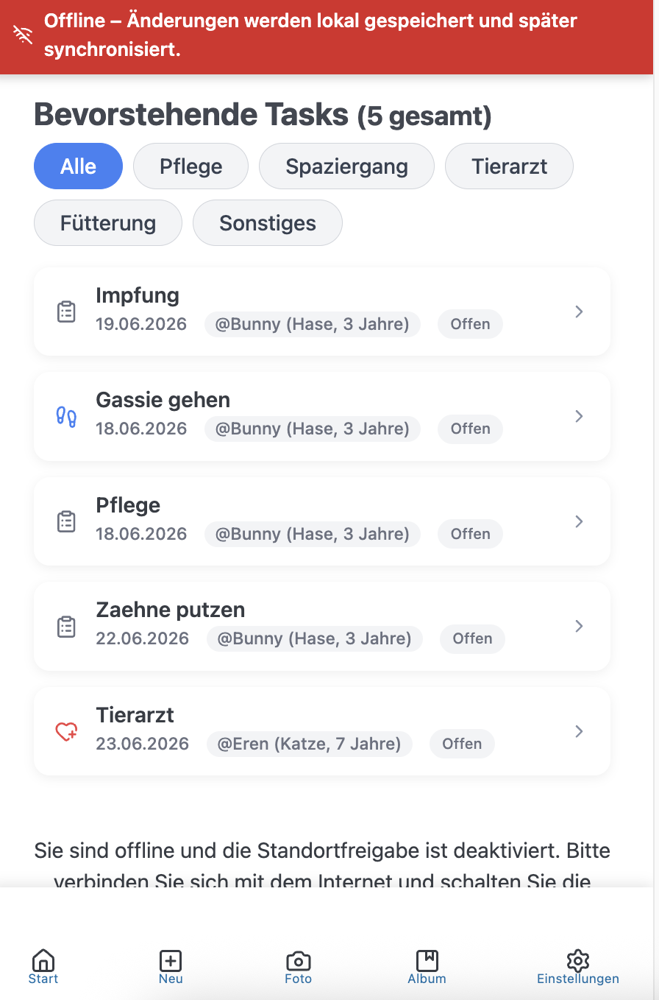
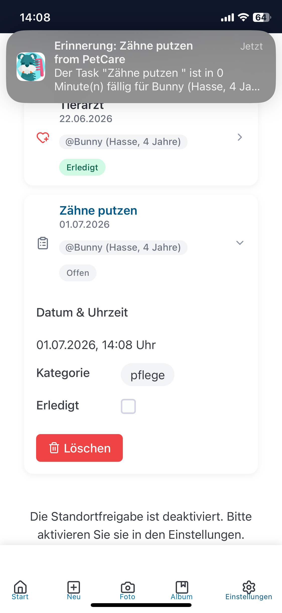

# Pet Care Tracker

Eine mobile Progressive Web App (PWA), die Haustierbesitzer:innen dabei unterstützt, die Pflege ihrer Tiere zu organisieren.

<p align="center">
  <a href="https://github.com/Dave200s1/PetCare-Tracker-/AppLogo.png">
    
  </a>
</p>
<br>
<p align="center">
  
  
  <br>
  Erstellt mit <b>React</b> und <b>MongoDB</b> in <b>JavaScript</b>.
</p>
<br>

---

## Überblick

Pet Care Tracker ist eine Webanwendung, die Nutzer:innen bei der Organisation von täglichen und langfristigen Aufgaben rund um ihre Haustiere unterstützt. Es können Haustiere angelegt sowie Fütterungszeiten, Tierarzttermine und Impfungen geplant werden.

Die Anwendung erinnert über Benachrichtigungen an anstehende Aufgaben und ist so konzipiert, dass sie auch offline funktioniert. Daten werden lokal gespeichert und bei bestehender Internetverbindung mit einer Datenbank synchronisiert.

---
<table>
    <tr>
        <td></td>
        <td></td>
        <td></td>
    <tr>
<table>

## Funktionen

- Anlegen und Verwalten von Haustieren
- Planung von Fütterungszeiten
- Verwaltung von Impfungen und Tierarztterminen
- Erinnerungen für anstehende Aufgaben
- Offline-Funktionalität mit lokaler Datenspeicherung
- Synchronisation mit einer Datenbank bei Online-Verbindung
- Installierbar als mobile App (PWA)

---

## Ziel des Projekts

Ziel des Projekts ist die Entwicklung einer mobilfreundlichen Webanwendung, die zentrale Konzepte von Progressive Web Apps demonstriert, darunter:

- Offline-Fähigkeit
- Push-Benachrichtigungen
- Responsives Design
- Integration mobiler Gerätefunktionen

---

## API-Endpoints

### Pets

| Method   | Endpoint               | Beschreibung                          |
|----------|------------------------|---------------------------------------|
| `POST`   | `/pets`                | Neues Haustier anlegen                |
| `GET`    | `/pets`                | Alle Haustiere abrufen                |
| `GET`    | `/pets/{id}`           | Einzelnes Haustier anhand der ID abrufen |
| `PUT`    | `/pets/{id}`           | Haustier aktualisieren                |
| `DELETE` | `/pets/delete/{id}`    | Haustier anhand der ID löschen        |

### Tasks

| Method   | Endpoint               | Beschreibung                          |
|----------|------------------------|---------------------------------------|
| `POST`   | `/tasks`               | Neue Aufgabe anlegen                  |
| `GET`    | `/tasks`               | Alle Aufgaben abrufen                 |
| `PUT`    | `/tasks/{id}`          | Aufgabe aktualisieren                 |
| `DELETE` | `/tasks/delete/{id}`   | Aufgabe anhand der ID löschen         |

---

## Datenmodelle

### Pet (Haustier)

| Feld     | Typ     | Beschreibung                          |
|----------|---------|---------------------------------------|
| `id`     | string  | Eindeutige Kennung (ObjectId)         |
| `name`   | string  | Name des Haustiers                    |
| `type`   | string  | Tierart (z. B. Hund, Katze)           |
| `age`    | number  | Alter des Haustiers                   |
| `Image`  | string  | (Optional) URL oder Pfad zum Bild     |

### Task (Aufgabe)

| Feld        | Typ      | Beschreibung                              |
|-------------|----------|-------------------------------------------|
| `id`        | string   | Eindeutige Kennung (ObjectId)             |
| `title`     | string   | Titel der Aufgabe                         |
| `category`  | string   | Kategorie (z. B. Füttern, Tierarzt)       |
| `completed` | boolean  | Status (erledigt / offen)                 |
| `date`      | string   | Datum der Aufgabe (z. B. "2026-07-01")    |
| `petId`     | string   | Referenz auf das zugehörige Haustier      |

---


##  Kernfunktionalität

Die Anwendung bietet Nutzern folgende Kernfunktionen:

- Verwaltung mehrerer Haustiere
- Erstellung und Verwaltung von Erinnerungen für verschiedene Aufgabentypen
- Übersicht über anstehende Termine und Aufgaben
- Empfang von Benachrichtigungen für wichtige Aktivitäten
- Standortbasierte Anzeige von Tierarztpraxen in der Nähe

---

## Technologie-Stack

- Frontend: React
- Backend: Node.js mit Express
- Datenbank: MongoDB
- ORM: TypeORM
- API: LatLng

---
## Installation

```bash
# Clone Repository
git clone https://github.com/Dave200s1/PetCare-Tracker-.git

# Navigiere in den Projektordner
cd pet-care-reminder

# Dependencies installieren
npm install

# Development server starten
npm run dev
